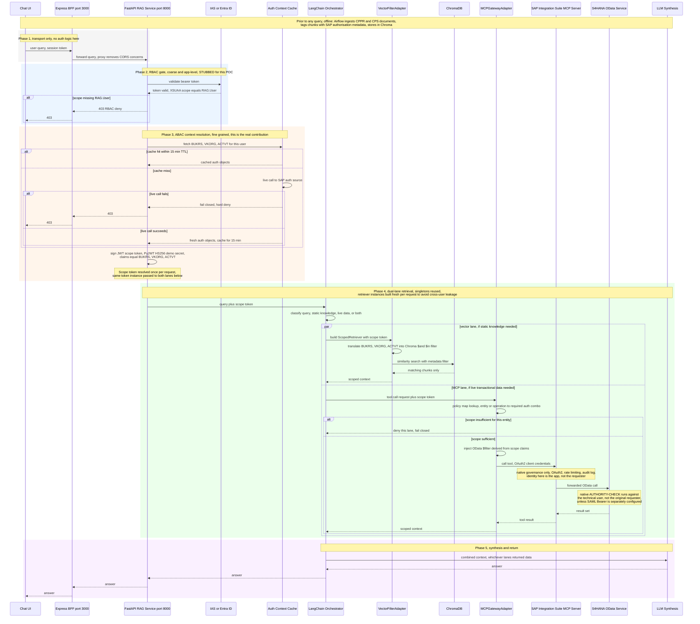

## End to End Solution sequence

```mermaid
sequenceDiagram
    participant Client as Chat UI
    participant BFF as Express BFF port 3000
    participant API as FastAPI RAG Service port 8000
    participant IAS as IAS or Entra ID
    participant AuthCtx as Auth Context Cache
    participant Orch as LangChain Orchestrator
    participant VFA as VectorFilterAdapter
    participant Chroma as ChromaDB
    participant MGA as MCPGatewayAdapter
    participant MCP as SAP Integration Suite MCP Server
    participant S4 as S4HANA OData Service
    participant LLM as LLM Synthesis

    Note over Client,LLM: Prior to any query, offline: Airflow ingests CPPR and CPS documents,<br/>tags chunks with SAP authorisation metadata, stores in Chroma

    rect rgb(245,245,245)
    Note over Client,BFF: Phase 1, transport only, no auth logic here
    Client->>BFF: user query, session token
    BFF->>API: forward query, proxy removes CORS concerns
    end

    rect rgb(235,245,255)
    Note over API,IAS: Phase 2, RBAC gate, coarse and app-level, STUBBED for this POC
    API->>IAS: validate bearer token
    IAS-->>API: token valid, XSUAA scope equals RAG.User
    alt scope missing RAG.User
        API-->>BFF: 403 RBAC deny
        BFF-->>Client: 403
    end
    end

    rect rgb(255,245,235)
    Note over API,AuthCtx: Phase 3, ABAC context resolution, fine grained, this is the real contribution
    API->>AuthCtx: fetch BUKRS, VKORG, ACTVT for this user
    alt cache hit within 15 min TTL
        AuthCtx-->>API: cached auth objects
    else cache miss
        AuthCtx->>AuthCtx: live call to SAP auth source
        alt live call fails
            AuthCtx-->>API: fail closed, hard deny
            API-->>BFF: 403
            BFF-->>Client: 403
        else live call succeeds
            AuthCtx-->>API: fresh auth objects, cache for 15 min
        end
    end
    API->>API: sign JWT scope token, PyJWT HS256 demo secret,<br/>claims equal BUKRS, VKORG, ACTVT
    Note over API: Scope token resolved once per request,<br/>same token instance passed to both lanes below
    end

    rect rgb(235,255,235)
    Note over API,LLM: Phase 4, dual-lane retrieval, singletons reused,<br/>retriever instances built fresh per request to avoid cross-user leakage
    API->>Orch: query plus scope token
    Orch->>Orch: classify query, static knowledge, live data, or both

    par vector lane, if static knowledge needed
        Orch->>VFA: build ScopedRetriever with scope token
        VFA->>VFA: translate BUKRS, VKORG, ACTVT into Chroma $and $in filter
        VFA->>Chroma: similarity search with metadata filter
        Chroma-->>VFA: matching chunks only
        VFA-->>Orch: scoped context
    and MCP lane, if live transactional data needed
        Orch->>MGA: tool call request plus scope token
        MGA->>MGA: policy map lookup, entity or operation to required auth combo
        alt scope insufficient for this entity
            MGA-->>Orch: deny this lane, fail closed
        else scope sufficient
            MGA->>MGA: inject OData $filter derived from scope claims
            MGA->>MCP: call tool, OAuth2 client credentials
            Note over MCP: native governance only, OAuth2, rate limiting, audit log.<br/>identity here is the app, not the requester
            MCP->>S4: forwarded OData call
            Note over S4: native AUTHORITY-CHECK runs against<br/>the technical user, not the original requester,<br/>unless SAML Bearer is separately configured
            S4-->>MCP: result set
            MCP-->>MGA: tool result
            MGA-->>Orch: scoped context
        end
    end
    end

    rect rgb(250,240,255)
    Note over Orch,LLM: Phase 5, synthesis and return
    Orch->>LLM: combined context, whichever lanes returned data
    LLM-->>Orch: answer
    Orch-->>API: answer
    API-->>BFF: answer
    BFF-->>Client: answer
    end
```
