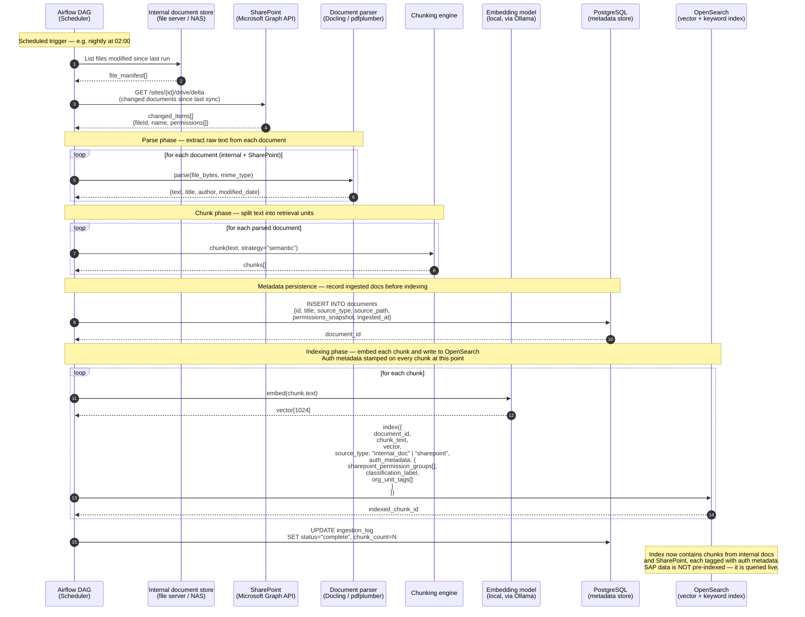
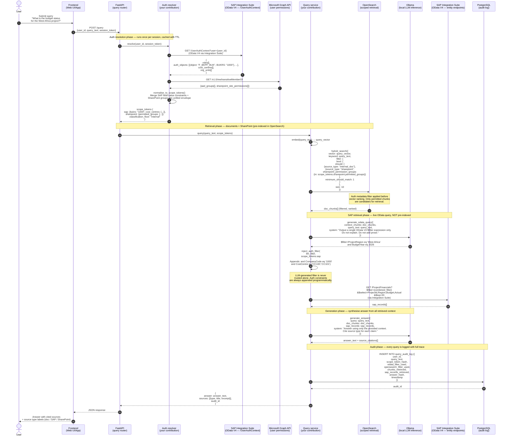

# Enterprise RAG — Sequence Diagrams

Two diagrams covering the two distinct flows in the system.

- **Diagram 1** covers the background ingestion pipeline that populates the vector index from internal documents and SharePoint. This runs on a schedule, not per user request.
- **Diagram 2** covers the per-request query flow, showing how a single user query fans out across all three data sources under a unified auth envelope.

---

## Diagram 1 — Ingestion pipeline (background, scheduled via Airflow)

This is the pattern adapted for enterprise sources.
No user is involved. Airflow triggers it on a schedule.
Auth metadata is stamped onto documents at ingestion time, not at query time.

---

## Diagram 2 — Query flow (per user request, all three sources)

This is the runtime flow. A single user query fans out to three sources.
Internal documents and SharePoint use the pre-built OpenSearch index.
SAP data is retrieved live via OData V4 through Integration Suite.
All three paths are gated by the same unified auth envelope resolved at login.

---

## Key architectural decisions visible in these diagrams

| Decision                                 | Where it appears           | Why it matters                                                                                                                                                 |
| ---------------------------------------- | -------------------------- | -------------------------------------------------------------------------------------------------------------------------------------------------------------- |
| SAP data is never pre-indexed            | Diagram 2, retrieval phase | ERP data changes frequently. Pre-indexing creates stale data risk and auth drift. Live OData query is always current.                                          |
| Documents and SharePoint ARE pre-indexed | Diagram 1                  | Unstructured docs change less frequently. Pre-indexing enables fast vector similarity search at query time.                                                    |
| Auth metadata stamped at ingestion       | Diagram 1, indexing loop   | Document permissions are baked into the index. A permission change requires re-ingestion — known limitation to document.                                       |
| LLM filter is never trusted alone        | Diagram 2, SAP retrieval   | The LLM generates a business filter (region, year). Auth constraints (company code, cost centre) are appended programmatically. This is the security boundary. |
| Single auth resolution per session       | Diagram 2, auth phase      | Resolving SAP auth objects and Graph permissions on every query would add unacceptable latency. TTL-cached scope tokens are the practical solution.            |
| Audit log captures scope token hash      | Diagram 2, audit phase     | Full scope token is not stored (PII risk). The hash is sufficient to reconstruct which permissions governed a query if audited.                                |

## What this adds to the arXiv curator baseline

| arXiv curator (baseline)           | Your extension                                           |
| ---------------------------------- | -------------------------------------------------------- |
| Single source: arXiv API           | Three sources: internal docs, SharePoint, SAP            |
| No auth — all users see everything | Unified auth envelope per user per session               |
| Documents only, no structured data | Documents + live structured ERP data                     |
| No OData integration               | SAP Integration Suite OData V4 live queries              |
| No audit trail                     | Full query audit log with scope token hash               |
| Airflow pulls from public API      | Airflow pulls from internal store + SharePoint Graph API |
