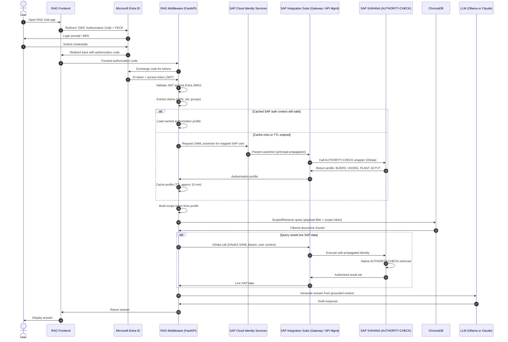

# RAG Integration with Microsoft Entra ID SSO and SAP S/4HANA

## 1. Purpose and Scope

This document describes how a RAG (Retrieval-Augmented Generation) system authenticates a user through Microsoft Entra ID (Azure AD) single sign-on, then uses that identity to reach SAP S/4HANA for both live OData queries and for resolving the user's SAP authorization profile, which in turn drives payload filtering on the vector store.

This is an infrastructure and identity-federation layer. It sits alongside, and feeds into, the existing SAP authorisation propagation middleware (scope token construction, `ScopedRetriever`, Chroma payload filtering). It does not replace that layer. The two solve different problems:

| Access path | What enforces access | Where |
|---|---|---|
| Live SAP OData query | AUTHORITY-CHECK, using the propagated user identity | Native, inside SAP S/4HANA |
| Vector store retrieval (RAG documents) | Payload filter built from the scope token | RAG middleware (`ScopedRetriever`) |
| Login to the RAG application | OIDC token validation | Microsoft Entra ID |

SAP's own authorization model has no visibility into an external vector database. That is the gap the scope token and `ScopedRetriever` close, and it remains necessary even with full SSO and principal propagation in place.

## 2. Assumptions and Constraints

- "Microsoft single sign-on" is treated as Microsoft Entra ID (formerly Azure AD), using OIDC / OAuth2 Authorization Code with PKCE.
- SAP target system is S/4HANA, reached exclusively through SAP Integration Suite exposing OData V4/V2 services. No RFC, no `pyrfc`.
- CDS views, where referenced at all, are design-time artefacts only. They are not a runtime integration path here.
- The federation broker is SAP Cloud Identity Services, specifically the Identity Authentication service (IAS), configured with Entra ID as a trusted corporate identity provider. This is SAP's documented pattern for bridging an external IdP into an ABAP backend. A direct Entra ID to ABAP SAML trust (via transaction SAML2) is an alternative if your landscape does not use IAS; swap the IAS steps below for that if so.
- Principal propagation to SAP uses an OAuth2 SAML Bearer Assertion exchange, so calls made with the resulting token are evaluated by SAP's native AUTHORITY-CHECK under the actual signed-in user, not a technical/service user.
- The custom "authority profile" lookup used to build the scope token is exposed as a bespoke OData service (SEGW or RAP-based), not as a standard SAP API, since SAP does not expose a native permission-flattening endpoint.

## 3. Sequence Diagram



## 4. Component Responsibilities

| Component | Responsibility |
|---|---|
| Microsoft Entra ID | Authenticates the user, issues ID token and access token, is the single source of truth for who the user is. |
| RAG Frontend | Initiates login redirect, holds the session, forwards the authorization code. |
| RAG Middleware (FastAPI) | Validates tokens, resolves the SAP identity, builds the scope token, orchestrates retrieval and generation. |
| SAP Cloud Identity Services (IAS) | Trust broker. Consumes the user's authenticated session context and issues a SAML assertion asserting the mapped SAP identity. |
| SAP Integration Suite (Gateway / API Management) | Exposes the OData services, performs the OAuth2 SAML Bearer token exchange, routes calls to the backend. |
| SAP S/4HANA | Executes AUTHORITY-CHECK natively against the propagated user for live queries; serves the custom authority profile lookup used for scope token construction. |
| ChromaDB | Vector store; enforces access only through the payload filter supplied by the middleware. |
| LLM (Ollama / ChatAnthropic) | Generates the final answer from whatever grounded context it is given. It has no authorization awareness of its own. |

## 5. Implementation Steps

### Phase A: Identity federation setup

1. Register the RAG application in Microsoft Entra ID (App registration). Define API scopes, redirect URIs, and generate a client credential (secret or certificate).
2. Create an Enterprise Application entry for SSO and assign the relevant users or groups.
3. Provision an SAP Cloud Identity Services (IAS) tenant, if one is not already available in your landscape.
4. In IAS, configure Microsoft Entra ID as a trusted corporate identity provider (SAML or OIDC federation), so IAS can broker authentication events originating from Entra ID.
5. In the SAP S/4HANA ABAP system, configure IAS as a trusted SAML 2.0 identity provider (transaction SAML2 or equivalent trust manager step), enabling principal propagation.
6. Establish the Entra ID to SAP user mapping. Either maintain this as an IAS user attribute, or as a lightweight mapping table owned by the middleware (UPN to SAP username). This mapping is a real operational dependency, not a one-off setup step.

### Phase B: SAP-side exposure

7. Build the custom "authority profile" OData service (SEGW or RAP-based) that wraps an internal AUTHORITY-CHECK call and returns the calling user's field-value authorizations (BUKRS, VKORG, PLANT, ACTVT, and so on) as structured data.
8. Expose this service, and the relevant business OData services used for live queries, through SAP Integration Suite.
9. Configure the OAuth2 SAML Bearer Assertion grant on the API Management layer, so a SAML assertion for a given SAP user can be exchanged for a scoped OAuth access token tied to that user.

### Phase C: Middleware build

10. Implement OIDC login handling and JWT validation against Entra ID's JWKS endpoint.
11. Implement the Entra ID to SAP user resolution step.
12. Implement the auth context resolver, live and cached modes, calling the authority profile OData service through the principal-propagated token.
13. Implement scope token construction from the resolved profile.
14. Wire the scope token into the existing `ScopedRetriever` and `handle_query` entrypoint.
15. Implement the live SAP OData branch for queries that need current transactional data, using the same principal-propagated token.

### Phase D: Testing and validation

16. Test login to token issuance in isolation before touching SAP.
17. Test the authority profile lookup with a single known test user, confirming the returned profile matches that user's actual SAP authorizations.
18. Test the cache miss and cache expiry paths deliberately, not just the happy path.
19. Test with at least two users with materially different authorization profiles (different company codes or plants) to confirm the payload filter actually changes.
20. Only after the above: test the live SAP OData branch end to end, confirming AUTHORITY-CHECK genuinely blocks out-of-scope records rather than the middleware silently trusting the response.

## 6. Python Pseudocode

### 6.1 OIDC login and JWT validation

```python
from fastapi import FastAPI, Depends, HTTPException, Request
from jose import jwt
import httpx

AAD_TENANT_ID = "your-tenant-id"
AAD_CLIENT_ID = "your-client-id"
JWKS_URL = f"https://login.microsoftonline.com/{AAD_TENANT_ID}/discovery/v2.0/keys"


async def get_jwks() -> dict:
    async with httpx.AsyncClient() as client:
        resp = await client.get(JWKS_URL)
        resp.raise_for_status()
        return resp.json()


async def validate_token(request: Request) -> dict:
    auth_header = request.headers.get("Authorization")
    if not auth_header or not auth_header.startswith("Bearer "):
        raise HTTPException(status_code=401, detail="Missing bearer token")

    token = auth_header.split(" ", 1)[1]
    jwks = await get_jwks()

    try:
        claims = jwt.decode(
            token,
            jwks,
            algorithms=["RS256"],
            audience=AAD_CLIENT_ID,
            issuer=f"https://login.microsoftonline.com/{AAD_TENANT_ID}/v2.0",
        )
    except jwt.JWTError:
        raise HTTPException(status_code=401, detail="Invalid token")

    return claims  # contains upn, oid, groups, and similar claims
```

### 6.2 Entra ID to SAP user mapping

```python
# No RFC or pyrfc involved. This only needs to resolve to a SAP username
# string, used later as the subject of the OData authority profile call.

def resolve_sap_user(aad_claims: dict) -> str:
    upn = aad_claims["upn"]
    sap_user = user_mapping_store.get(upn)
    if not sap_user:
        raise LookupError(f"No SAP user mapping found for {upn}")
    return sap_user
```

### 6.3 Auth context resolver, live and cached modes

```python
from datetime import datetime, timedelta

AUTH_CACHE_TTL_MINUTES = 15
_auth_cache: dict[str, tuple[dict, datetime]] = {}


async def resolve_auth_context(sap_user: str, mode: str = "cached") -> dict:
    now = datetime.utcnow()

    if mode == "cached" and sap_user in _auth_cache:
        profile, cached_at = _auth_cache[sap_user]
        if now - cached_at < timedelta(minutes=AUTH_CACHE_TTL_MINUTES):
            return profile

    try:
        profile = await fetch_sap_authority_profile(sap_user)
    except SAPConnectionError:
        # Cache miss and live call both failing is one of the open design
        # questions in the broader project. Current default here is
        # deny-by-default: return a zero-privilege profile rather than
        # silently reusing a stale cache entry.
        return {"BUKRS": [], "VKORG": [], "PLANT": [], "ACTVT": []}

    _auth_cache[sap_user] = (profile, now)
    return profile


async def fetch_sap_authority_profile(sap_user: str) -> dict:
    """
    Calls the custom AUTHORITY-CHECK wrapper exposed as an OData V4/V2
    service through SAP Integration Suite. Authentication uses principal
    propagation (OAuth2 SAML Bearer Assertion), not a technical user, so
    the check reflects the actual signed-in user's authorizations.
    """
    token = await get_saml_bearer_token(sap_user)
    async with httpx.AsyncClient() as client:
        resp = await client.get(
            f"{SAP_GATEWAY_BASE}/AuthorityProfileSet('{sap_user}')",
            headers={"Authorization": f"Bearer {token}"},
        )
        resp.raise_for_status()
        return resp.json()
```

### 6.4 Principal propagation token exchange

```python
async def get_saml_bearer_token(sap_user: str) -> str:
    """
    Pseudocode for principal propagation:

    1. Middleware requests a SAML assertion for sap_user from SAP Cloud
       Identity Services (IAS), authenticating as itself (trusted client).
    2. IAS issues a SAML assertion asserting the sap_user identity.
    3. Middleware exchanges that assertion for an OAuth2 access token at
       SAP Integration Suite's token endpoint, using the
       urn:ietf:params:oauth:grant-type:saml2-bearer grant.
    4. The resulting access token carries the sap_user identity context,
       so calls made with it are subject to SAP's native AUTHORITY-CHECK,
       not the middleware's own service account.
    """
    saml_assertion = await request_saml_assertion(sap_user)              # steps 1-2
    token_response = await exchange_saml_for_oauth_token(saml_assertion)  # step 3
    return token_response["access_token"]
```

### 6.5 Scope token construction

```python
def build_scope_token(auth_profile: dict) -> dict:
    return {
        "company_codes": auth_profile.get("BUKRS", []),
        "sales_orgs": auth_profile.get("VKORG", []),
        "plants": auth_profile.get("PLANT", []),
        "activities": auth_profile.get("ACTVT", []),
    }
```

### 6.6 Updated entrypoint

```python
async def handle_query(request: Request, user_query: str):
    claims = await validate_token(request)
    sap_user = resolve_sap_user(claims)

    auth_profile = await resolve_auth_context(sap_user, mode="cached")
    scope_token = build_scope_token(auth_profile)

    retriever = ScopedRetriever(vectorstore=chroma_db, scope_token=scope_token)
    docs = retriever.get_relevant_documents(user_query)

    live_data = None
    if needs_live_sap_data(user_query):
        live_data = await fetch_live_sap_data(user_query, sap_user, scope_token)

    return await generate_answer(user_query, docs, live_data)
```

## 7. Open Questions Introduced by This Layer

1. **Mapping ownership.** If IAS attribute mapping is not used, something has to own and maintain the Entra ID to SAP user mapping table. Stale mappings fail silently unless explicitly monitored.
2. **Session lifetime versus conversation length.** Entra ID access tokens are short-lived. A long RAG conversation may outlive the token, requiring silent refresh handling that has not been designed here.
3. **Unreachable IAS or gateway at login time.** This is a variant of the existing cache-miss-with-no-fallback question already open in the core middleware design, now surfaced one layer earlier, at login rather than at query time.

## 8. Where This Fits the Existing Project

This document is infrastructure context. It explains the identity plumbing around the middleware, and specifically why the vector store still needs its own enforcement mechanism even once enterprise SSO and principal propagation are in place. The scope token, `ScopedRetriever`, and Chroma payload filter remain the project's actual contribution; nothing here should be presented as replacing or extending that core claim.