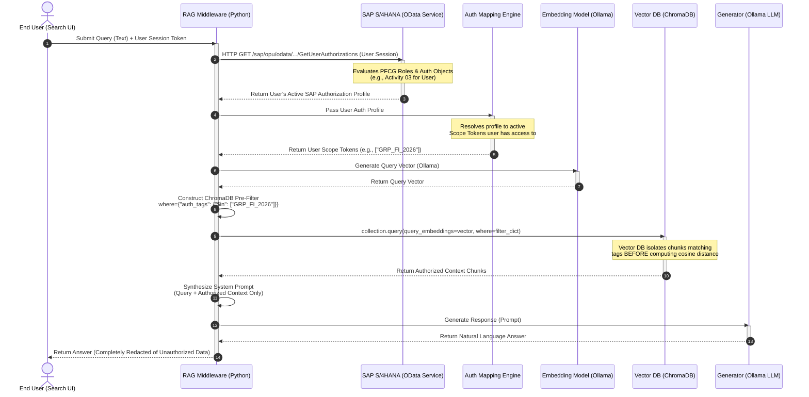

# Retrieval Pipeline: Pre-Filtering & Authorization Propagation

This sequence details how a user's search query triggers a real-time authorization check against SAP, applies pre-filtering before hitting ChromaDB, and returns authorized context to Ollama.

