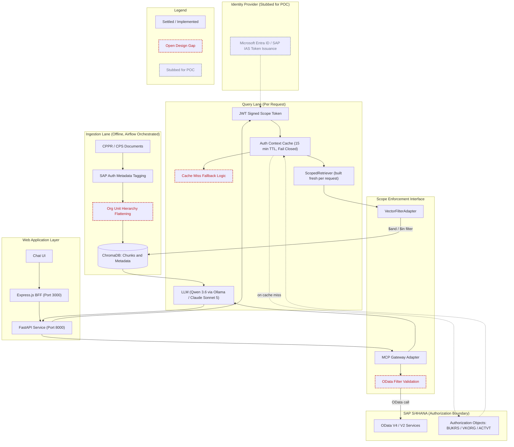

## Solution Architecture - Revision 1

```mermaid
graph TB

    subgraph IDP_ZONE["Identity Provider (Stubbed for POC)"]
        IDP["Microsoft Entra ID / SAP IAS Token Issuance"]
    end

    subgraph WEB["Web Application Layer"]
        UI["Chat UI"]
        BFF["Express.js BFF (Port 3000)"]
        API["FastAPI Service (Port 8000)"]
    end

    subgraph QRY["Query Lane (Per Request)"]
        TOKEN["JWT Signed Scope Token"]
        CACHE["Auth Context Cache (15 min TTL, Fail Closed)"]
        FALLBACK["Cache Miss Fallback Logic"]
        RETRIEVER["ScopedRetriever (built fresh per request)"]
        LLMBOX["LLM (Qwen 3.6 via Ollama / Claude Sonnet 5)"]
    end

    subgraph ENF["Scope Enforcement Interface"]
        VFA["VectorFilterAdapter"]
        MGA["MCP Gateway Adapter"]
        VALID["OData Filter Validation"]
    end

    subgraph ING["Ingestion Lane (Offline, Airflow Orchestrated)"]
        DOC["CPPR / CPS Documents"]
        TAG["SAP Auth Metadata Tagging"]
        FLAT["Org Unit Hierarchy Flattening"]
        CHROMA[("ChromaDB: Chunks and Metadata")]
    end

    subgraph SAP["SAP S/4HANA (Authorization Boundary)"]
        SAP_ODATA["OData V4 / V2 Services"]
        SAP_AUTH["Authorization Objects: BUKRS / VKORG / ACTVT"]
    end

    subgraph LEGEND["Legend"]
        SETTLEDX["Settled / Implemented"]
        GAPX["Open Design Gap"]
        STUBX["Stubbed for POC"]
    end

    IDP -.-> TOKEN

    UI --> BFF --> API
    API --> TOKEN
    TOKEN --> CACHE
    CACHE --> FALLBACK
    CACHE --> RETRIEVER
    RETRIEVER --> VFA
    VFA -->|"$and / $in filter"| CHROMA
    CHROMA --> LLMBOX
    API --> MGA
    MGA --> VALID
    VALID -->|"OData call"| SAP_ODATA
    MGA --> LLMBOX
    LLMBOX --> API

    CACHE -.->|"on cache miss"| SAP_AUTH
    SAP_AUTH -.-> CACHE

    DOC --> TAG --> FLAT --> CHROMA

    classDef gap stroke-dasharray: 4 3,stroke:#b91c1c,stroke-width:2px,color:#b91c1c
    classDef stub stroke-dasharray: 2 2,stroke:#6b7280,stroke-width:2px,color:#6b7280

    class FLAT,VALID,FALLBACK,GAPX gap
    class IDP,STUBX stub
```
