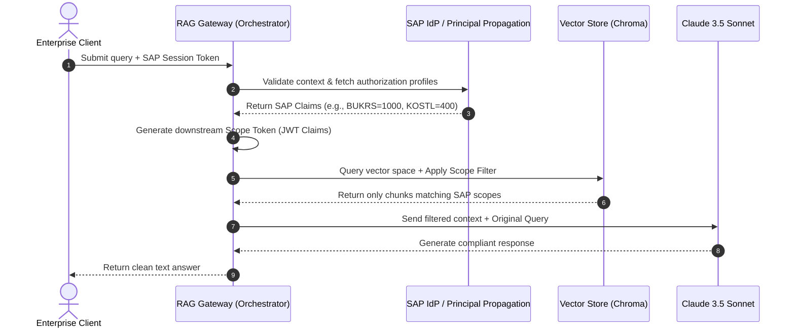

# Enterprise RAG Scope Token Pattern with SAP Authorization Mapping

This document provides a comprehensive blueprint and reference implementation for enforcing SAP enterprise data permissions within a Retrieval-Augmented Generation (RAG) system. 

By mapping SAP authorization fields directly to document metadata constraints, we achieve secure, zero-trust data retrieval.

## 1. System Architecture

The core mechanic involves a **Token Exchange and Scoping Engine**:
1. The client sends a query along with an enterprise SAP OAuth token or session state.
2. The RAG API Gateway validates this token against SAP services.
3. The gateway creates a secure **Scope Token** containing only the relevant data-boundary claims (e.g., `BUKRS` / Company Codes, `KOSTL` / Cost Centers).
4. The orchestrator converts these scope claims into native metadata filters required by the vector database.

### Data Flow Diagram



---

## 2. Secure RAG Implementation Script

The python script below demonstrates how to extract authorization parameters from an SAP-like user token, parse them into MongoDB-style logical query operators for Chroma, and safely feed them into an orchestrated LangChain workflow using **Ollama** embeddings (`qwen3:embedding`) and **Anthropic Claude**.

```python
import os
from typing import Dict, Any, List
import jwt  # PyJWT library to parse/verify scope tokens
from langchain_core.documents import Document
from langchain_chroma import Chroma
from langchain_community.embeddings import OllamaEmbeddings
from langchain_anthropic import ChatAnthropic
from langchain_core.prompts import ChatPromptTemplate
from langchain_core.runnables import RunnablePassthrough
from langchain_core.output_parsers import StrOutputParser

# =====================================================================
# 1. COMPONENT INITIALIZATION
# =====================================================================

# Initialize Ollama with Qwen3 Embedding Model
# (Assumes local instance is active: 'ollama run qwen3:embedding')
embeddings = OllamaEmbeddings(model="qwen3:embedding")

# Initialize Chroma Vector Database in memory for this demonstration
vector_store = Chroma(
    collection_name="sap_secured_enterprise_docs",
    embedding_function=embeddings
)

# Initialize Claude 3.5 Sonnet through LangChain
# Requires the ANTHROPIC_API_KEY environment variable to be set
llm = ChatAnthropic(
    model="claude-3-5-sonnet-20241022",
    temperature=0.0
)

# Shared secret key used to sign and verify our internal RAG Scope Tokens
JWT_SECRET = "sap_rag_enterprise_secure_token_secret_12345"

# =====================================================================
# 2. MOCK PIPELINE DATA (Simulating Ingested & Pre-Tagged SAP Docs)
# =====================================================================
# Documents are assumed to be ingested with structural SAP metadata tags:
# 'bukrs' = Company Code (Buchungskreis)
# 'kostl' = Cost Center (Kostenstelle)

mock_enterprise_knowledge_base = [
    Document(
        page_content="[CONFIDENTIAL] Project Alpha Strategy: EU expansion target for Berlin operations is set to €12M for Q4.",
        metadata={"bukrs": "1000", "kostl": "400", "confidentiality": "RESTRICTED"}
    ),
    Document(
        page_content="[INTERNAL] US Logistics Roadmap: Chicago distribution center floor space will increase by 45,000 sq ft.",
        metadata={"bukrs": "2000", "kostl": "500", "confidentiality": "INTERNAL"}
    ),
    Document(
        page_content="[GLOBAL] Global HR Policy handbook: Standard corporate annual leave allocation across all regions is 25 days.",
        metadata={"bukrs": "GLOBAL", "kostl": "ALL", "confidentiality": "PUBLIC"}
    )
]

# Seed our test vector store with the pre-tagged enterprise documents
vector_store.add_documents(mock_enterprise_knowledge_base)


# =====================================================================
# 3. SAP SCOPE CONVERSION & TRANSLATION ENGINE
# =====================================================================
def generate_mock_sap_scope_token(user_id: str, company_code: str, cost_center: str) -> str:
    """Simulates the RAG Gateway minting a short-lived Scope Token after verifying SAP access."""
    payload = {
        "sub": user_id,
        "sap_scopes": {
            "BUKRS": company_code,
            "KOSTL": cost_center
        }
    }
    return jwt.encode(payload, JWT_SECRET, algorithm="HS256")


def translate_scope_token_to_chroma_filter(scope_token: str) -> Dict[str, Any]:
    """
    Decodes the internal Scope Token and maps the explicit SAP claims 
    into standard logical expressions ($and, $or, $eq) used by Chroma DB.
    """
    try:
        # Decode and verify the cryptographic signature of the Scope Token
        decoded = jwt.decode(scope_token, JWT_SECRET, algorithms=["HS256"])
        sap_scopes = decoded.get("sap_scopes", {})
        
        user_bukrs = sap_scopes.get("BUKRS", "")
        user_kostl = sap_scopes.get("KOSTL", "")
        
        # Build strict structural authorization filter boundaries.
        # User can only view data matching their specific assignment OR globally declared documents.
        chroma_filter = {
            "$and": [
                {
                    "$or": [
                        {"bukrs": {"$eq": user_bukrs}},
                        {"bukrs": {"$eq": "GLOBAL"}}
                    ]
                },
                {
                    "$or": [
                        {"kostl": {"$eq": user_kostl}},
                        {"kostl": {"$eq": "ALL"}}
                    ]
                }
            ]
        }
        return chroma_filter
        
    except jwt.PyJWTError:
        # If token manipulation is detected or signature fails, return an absolute isolation block
        return {"$and": [{"bukrs": {"$eq": "BLOCK_ALL"}}, {"kostl": {"$eq": "BLOCK_ALL"}}]}


# =====================================================================
# 4. ORCHESTRATION PIPELINE
# =====================================================================
def run_secure_enterprise_rag(query: str, client_scope_token: str) -> str:
    """Executes a LangChain RAG pipeline strictly gated by the resolved scope metadata filters."""
    
    # 1. Translate token directly into low-level metadata query filters
    db_metadata_filter = translate_scope_token_to_chroma_filter(client_scope_token)
    
    # 2. Instantiate a retriever instance using the active runtime metadata constraint
    secure_retriever = vector_store.as_retriever(
        search_kwargs={
            "filter": db_metadata_filter,
            "k": 2
        }
    )
    
    # 3. Create context-aware system instruction template
    prompt_template = """
    You are an enterprise AI assistant bound by SAP principal propagation rules.
    Answer the user's question based strictly and exclusively on the context fragments provided below.
    If the context does not contain the necessary information to formulate an answer, state that you cannot provide this information due to data access limitations or missing context. Do not invent details.
    
    Context:
    {context}
    
    Question: {question}
    Answer:
    """
    prompt = ChatPromptTemplate.from_template(prompt_template)
    
    # Context extraction helper function
    def serialize_docs(docs: List[Document]) -> str:
        if not docs:
            return "NO ACCESSIBLE RECORDS FOUND IN AUTHORIZATION ZONE."
        return "\n\n".join(doc.page_content for doc in docs)
    
    # 4. Construct the LangChain Expression Language (LCEL) chain execution plan
    rag_chain = (
        {"context": secure_retriever | serialize_docs, "question": RunnablePassthrough()}
        | prompt
        | llm
        | StrOutputParser()
    )
    
    # 5. Run the transaction
    return rag_chain.invoke(query)


# =====================================================================
# 5. VERIFICATION SCENARIOS
# =====================================================================
if __name__ == "__main__":
    # Generate distinct scope tokens mimicking different SAP organizational logins
    european_manager_token = generate_mock_sap_scope_token(
        user_id="em1000", company_code="1000", cost_center="400"
    )
    us_logistics_agent_token = generate_mock_sap_scope_token(
        user_id="ul2000", company_code="2000", cost_center="500"
    )

    print("=====================================================================")
    print("SCENARIO 1: Authorized access check (EU Manager queries Berlin Targets)")
    print("=====================================================================")
    query_1 = "What are the Q4 target amounts for the Berlin operations expansion?"
    res_1 = run_secure_enterprise_rag(query_1, european_manager_token)
    print(f"Query: {query_1}\nResponse:\n{res_1}\n")

    print("=====================================================================")
    print("SCENARIO 2: Cross-tenant isolation check (US Agent queries Berlin Targets)")
    print("=====================================================================")
