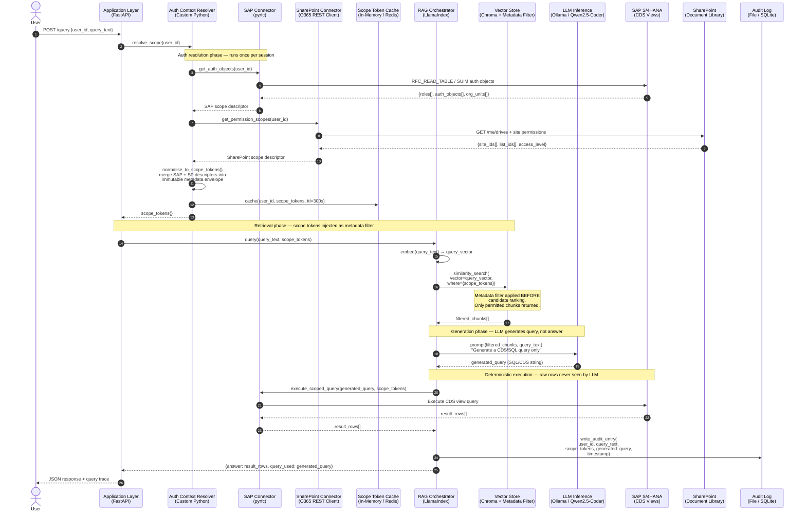
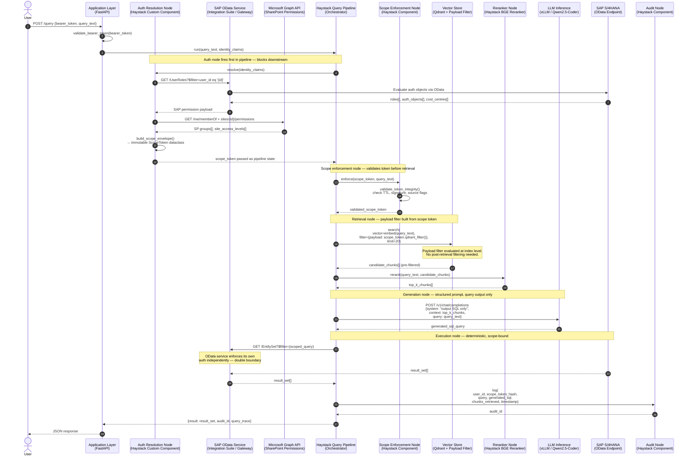
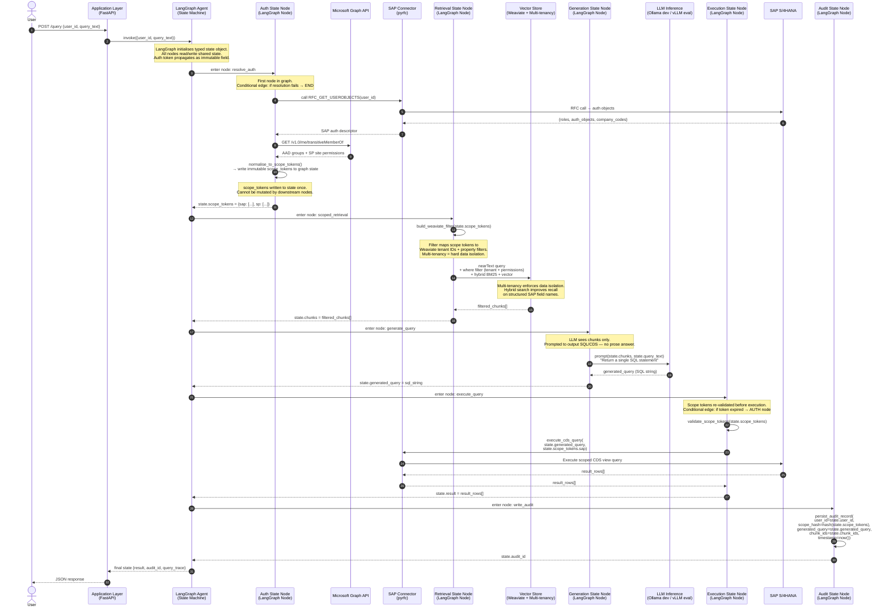
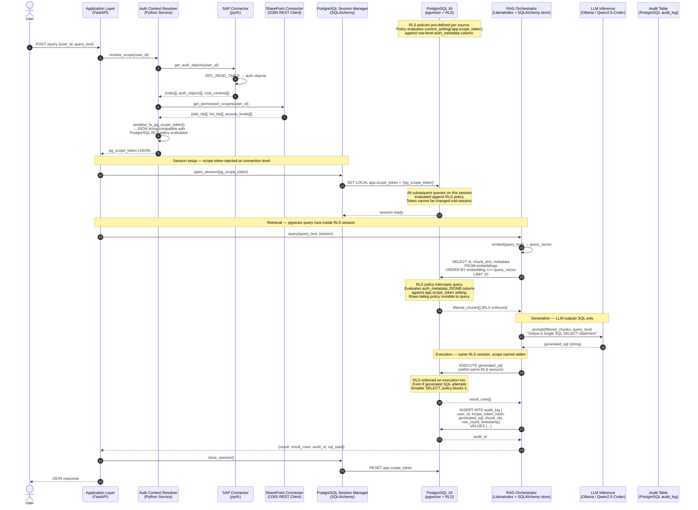

# Auth-Aware Multi-Source RAG — Sequence Diagrams

Four sequence diagrams, one per proposed tech stack.
Each diagram traces a single user query from authentication through
to response, showing every system touched and where authorisation
enforcement occurs.

---

## Stack A — Lean Research Stack
**LlamaIndex + Ollama + Chroma + Custom Python Middleware**

---

## Stack B — Enterprise-Grade Stack
**Haystack Pipelines + vLLM + Qdrant + SAP OData + Microsoft Graph API**

---

## Stack C — Hybrid Orchestration Stack
**LlamaIndex (ingestion) + LangGraph (orchestration) + Weaviate + Ollama/vLLM**

---

## Stack D — Postgres-Native Stack
**LlamaIndex + SQLAlchemy + pgvector + PostgreSQL RLS + Ollama**

---

## Reading guide

| Symbol / pattern | Meaning across all diagrams |
|---|---|
| `Note over X` | Where auth enforcement actually happens — these are the security boundary markers |
| Numbered steps | Correspond to pipeline phases: auth resolution, retrieval, generation, execution, audit |
| `-->>` dashed return arrows | Data flowing back up the call chain |
| `->>` solid arrows | Active calls / requests |
| Conditional edges (Stack C) | LangGraph-specific: graph exits early if auth fails rather than continuing with degraded scope |
| `SET LOCAL app.scope_token` (Stack D) | The PostgreSQL RLS activation step — most architecturally significant line in that diagram |

## Key architectural difference across stacks

| Stack | Where auth is enforced | Enforcement mechanism |
|---|---|---|
| A (Lean) | Application layer + Chroma metadata filter | Python middleware injects filter before vector search |
| B (Enterprise) | Haystack pipeline node + Qdrant payload filter | Auth is a first-class pipeline component, auditable as a node |
| C (LangGraph) | Graph state machine + Weaviate multi-tenancy | Auth token is immutable graph state, tenant isolation is structural |
| D (Postgres) | Database layer — PostgreSQL RLS | Scope token set at session level, policy enforced by DB engine on every query |
