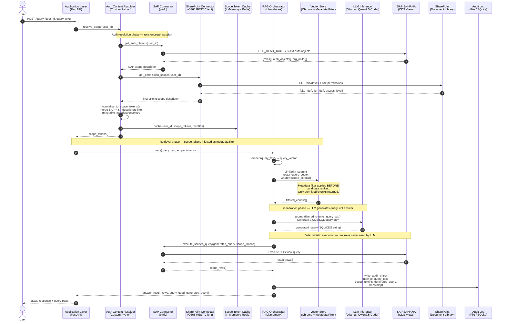
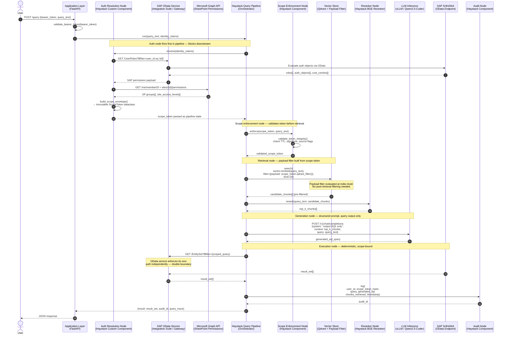
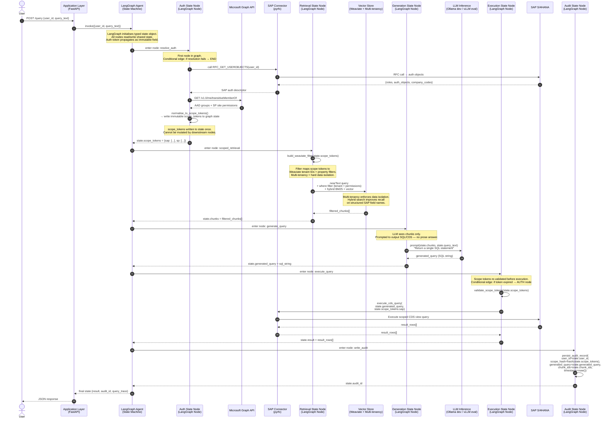
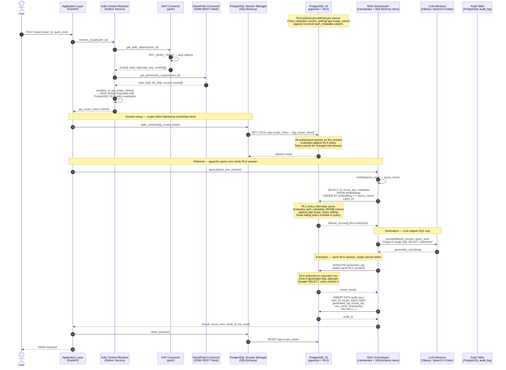
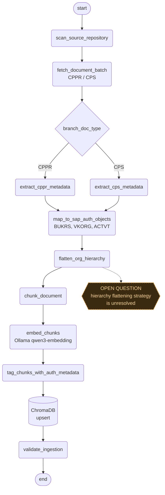
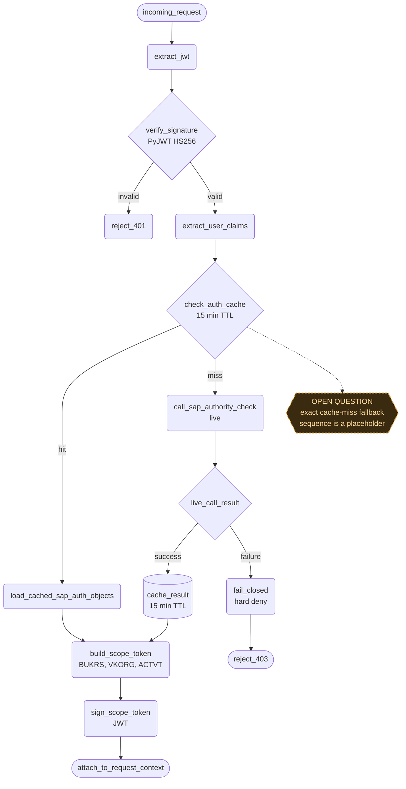
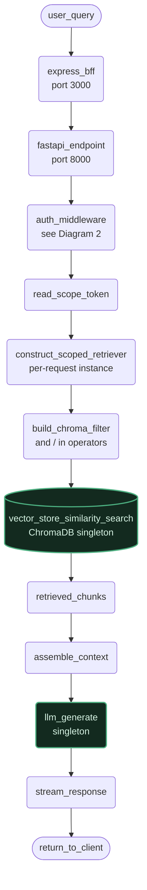
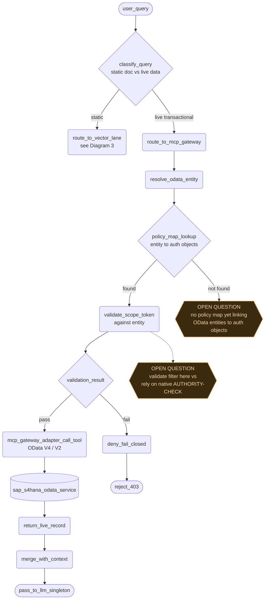
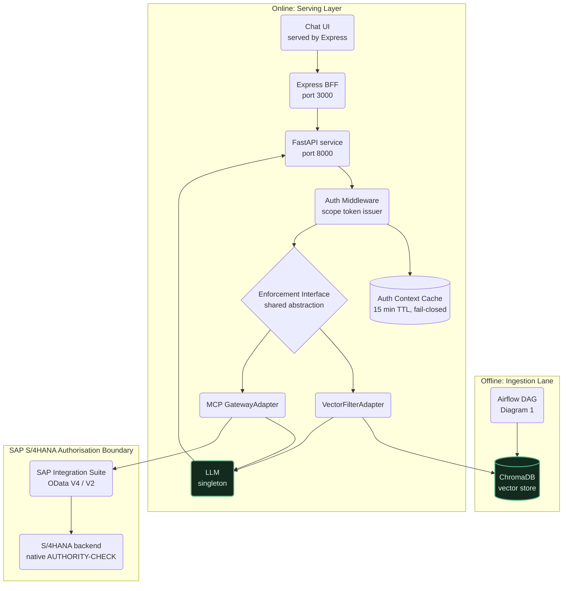
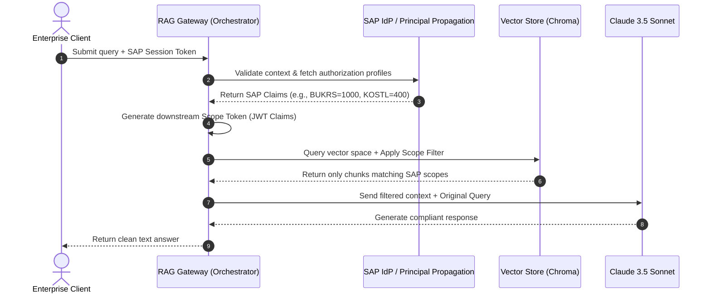

# Auth-Aware Multi-Source RAG — Sequence Diagrams

Four sequence diagrams, one per proposed tech stack.
Each diagram traces a single user query from authentication through
to response, showing every system touched and where authorisation
enforcement occurs.

---

## Stack A — Lean Research Stack

**LlamaIndex + Ollama + Chroma + Custom Python Middleware**



---

## Stack B — Enterprise-Grade Stack

**Haystack Pipelines + vLLM + Qdrant + SAP OData + Microsoft Graph API**



---

## Stack C — Hybrid Orchestration Stack

**LlamaIndex (ingestion) + LangGraph (orchestration) + Weaviate + Ollama/vLLM**



---

## Stack D — Postgres-Native Stack

**LlamaIndex + SQLAlchemy + pgvector + PostgreSQL RLS + Ollama**



---

## Reading guide

| Symbol / pattern                      | Meaning across all diagrams                                                                    |
| ------------------------------------- | ---------------------------------------------------------------------------------------------- |
| `Note over X`                         | Where auth enforcement actually happens — these are the security boundary markers              |
| Numbered steps                        | Correspond to pipeline phases: auth resolution, retrieval, generation, execution, audit        |
| `-->>` dashed return arrows           | Data flowing back up the call chain                                                            |
| `->>` solid arrows                    | Active calls / requests                                                                        |
| Conditional edges (Stack C)           | LangGraph-specific: graph exits early if auth fails rather than continuing with degraded scope |
| `SET LOCAL app.scope_token` (Stack D) | The PostgreSQL RLS activation step — most architecturally significant line in that diagram     |

## Key architectural difference across stacks

| Stack          | Where auth is enforced                         | Enforcement mechanism                                                         |
| -------------- | ---------------------------------------------- | ----------------------------------------------------------------------------- |
| A (Lean)       | Application layer + Chroma metadata filter     | Python middleware injects filter before vector search                         |
| B (Enterprise) | Haystack pipeline node + Qdrant payload filter | Auth is a first-class pipeline component, auditable as a node                 |
| C (LangGraph)  | Graph state machine + Weaviate multi-tenancy   | Auth token is immutable graph state, tenant isolation is structural           |
| D (Postgres)   | Database layer — PostgreSQL RLS                | Scope token set at session level, policy enforced by DB engine on every query |

# Authorisation Propagation RAG Pipeline: Architecture Diagrams

Reference convention (mirrors the Airflow-style DAG you supplied):

- Stadium shape `([...])` = pipeline entry or exit point
- Rounded rectangle `(...)` = processing step / task
- Diamond `{...}` = decision or branch point
- Cylinder `[(...)]` = data store or external persistent service
- Dashed orange hexagon `{{...}}` = open design question, unresolved as of this writing
- Green outline = singleton component, initialised once and shared across requests

---

## 1. Data Ingestion Pipeline with Tagging



**Notes:**

- Orchestrated by Airflow, matching the task-per-node convention in your reference DAG.
- The CPPR / CPS branch assumes each document type needs distinct metadata extraction logic. If both types share identical extraction code, collapse E and F into one task.
- `flatten_org_hierarchy` is drawn as a real task because it will need to exist eventually, but the strategy behind it is still open (Chroma's flat equality filters cannot natively express SAP org-unit hierarchy).

---

## 2. User Access / Auth Context Pipeline



**Notes:**

- Fail-closed is applied on both the cache-miss-then-live-call-failure path (H to J) and the invalid-signature path (C to Z). That principle is settled.
- What is not settled: the diagram assumes a synchronous live call sits directly in the request path on a cache miss. That is a latency and availability tradeoff worth defending explicitly rather than leaving implicit.

---

## 3. Query Pipeline (Retrieval and Generation)



**Notes:**

- `build_chroma_filter` compiles the scope token's BUKRS, VKORG, and ACTVT values into Chroma's `$and` / `$in` metadata filter syntax.
- Green nodes (H, K) are the singletons: embeddings client, vector store handle, and LLM client are constructed once at startup. Everything else in this diagram is built fresh per request, which is the point of the `ScopedRetriever` pattern, it is what prevents the multi-user filter-leakage anti-pattern.

---

## 4. MCP Gateway / Live Transactional Data Pipeline



**Notes:**

- This is the live-data counterpart to Diagram 3, unified with it only at the scope token layer, not at the retrieval mechanism layer.
- The classify_query branch (B) is drawn before the auth check for readability. Confirm whether classification should actually happen after scope token validation in your real implementation, the ordering has security implications if classification logic itself reads unfiltered data.

---

## 5. System Component Interaction and Flow



**Notes:**

- This is the diagram that carries your RQ1 gap claim visually: ChromaDB (vector store) sits entirely outside the SAP authorisation boundary subgraph. The MCP GatewayAdapter is the only path that crosses back into it, via OData, where SAP's native AUTHORITY-CHECK still applies.
- `ENFORCE` is drawn as a single decision node with two adapters beneath it. The diagram alone asserts they share an interface, it does not demonstrate it. That demonstration has to happen in code (a common abstract base class or protocol both adapters implement), or the RQ2 "standardised beyond SAP" claim is asserted rather than shown.

---

## Open Design Questions (Consolidated)

| #   | Question                                                                                                                | Appears in | Status              |
| --- | ----------------------------------------------------------------------------------------------------------------------- | ---------- | ------------------- |
| 1   | Hierarchy pre-flattening strategy for SAP org-unit fields in Chroma metadata                                            | Diagram 1  | Unresolved          |
| 2   | Exact cache-miss fallback sequence (retry, timeout, queueing behaviour)                                                 | Diagram 2  | Placeholder in code |
| 3   | Whether OData filter validation happens at the middleware layer or is deferred entirely to SAP's native AUTHORITY-CHECK | Diagram 4  | Unresolved          |
| 4   | No policy map yet exists linking OData entities to required BUKRS / VKORG / ACTVT combinations                          | Diagram 4  | Not started         |

This table is the fastest way to locate every deliberately-open decision point across the architecture in one place for viva prep.

# Enterprise RAG Scope Token Pattern with SAP Authorization Mapping

This document provides a comprehensive blueprint and reference implementation for enforcing SAP enterprise data permissions within a Retrieval-Augmented Generation (RAG) system.

By mapping SAP authorization fields directly to document metadata constraints, we achieve secure, zero-trust data retrieval.

## 1. System Architecture

The core mechanic involves a **Token Exchange and Scoping Engine**:

1. The client sends a query along with an enterprise SAP OAuth token or session state.
2. The RAG API Gateway validates this token against SAP services.
3. The gateway creates a secure **Scope Token** containing only the relevant data-boundary claims (e.g., `BUKRS` / Company Codes, `KOSTL` / Cost Centers).
4. The orchestrator converts these scope claims into native metadata filters required by the vector database.

### Data Flow Diagram



---

## 2. Secure RAG Implementation Script

The python script below demonstrates how to extract authorization parameters from an SAP-like user token, parse them into MongoDB-style logical query operators for Chroma, and safely feed them into an orchestrated LangChain workflow using **Ollama** embeddings (`qwen3:embedding`) and **Anthropic Claude**.

````python
import os
from typing import Dict, Any, List
import jwt  # PyJWT library to parse/verify scope tokens
from langchain_core.documents import Document
from langchain_chroma import Chroma
from langchain_community.embeddings import OllamaEmbeddings
from langchain_anthropic import ChatAnthropic
from langchain_core.prompts import ChatPromptTemplate
from langchain_core.runnables import RunnablePassthrough
from langchain_core.output_parsers import StrOutputParser

# =====================================================================
# 1. COMPONENT INITIALIZATION
# =====================================================================

# Initialize Ollama with Qwen3 Embedding Model
# (Assumes local instance is active: 'ollama run qwen3:embedding')
embeddings = OllamaEmbeddings(model="qwen3:embedding")

# Initialize Chroma Vector Database in memory for this demonstration
vector_store = Chroma(
    collection_name="sap_secured_enterprise_docs",
    embedding_function=embeddings
)

# Initialize Claude 3.5 Sonnet through LangChain
# Requires the ANTHROPIC_API_KEY environment variable to be set
llm = ChatAnthropic(
    model="claude-3-5-sonnet-20241022",
    temperature=0.0
)

# Shared secret key used to sign and verify our internal RAG Scope Tokens
JWT_SECRET = "sap_rag_enterprise_secure_token_secret_12345"

# =====================================================================
# 2. MOCK PIPELINE DATA (Simulating Ingested & Pre-Tagged SAP Docs)
# =====================================================================
# Documents are assumed to be ingested with structural SAP metadata tags:
# 'bukrs' = Company Code (Buchungskreis)
# 'kostl' = Cost Center (Kostenstelle)

mock_enterprise_knowledge_base = [
    Document(
        page_content="[CONFIDENTIAL] Project Alpha Strategy: EU expansion target for Berlin operations is set to €12M for Q4.",
        metadata={"bukrs": "1000", "kostl": "400", "confidentiality": "RESTRICTED"}
    ),
    Document(
        page_content="[INTERNAL] US Logistics Roadmap: Chicago distribution center floor space will increase by 45,000 sq ft.",
        metadata={"bukrs": "2000", "kostl": "500", "confidentiality": "INTERNAL"}
    ),
    Document(
        page_content="[GLOBAL] Global HR Policy handbook: Standard corporate annual leave allocation across all regions is 25 days.",
        metadata={"bukrs": "GLOBAL", "kostl": "ALL", "confidentiality": "PUBLIC"}
    )
]

# Seed our test vector store with the pre-tagged enterprise documents
vector_store.add_documents(mock_enterprise_knowledge_base)


# =====================================================================
# 3. SAP SCOPE CONVERSION & TRANSLATION ENGINE
# =====================================================================
def generate_mock_sap_scope_token(user_id: str, company_code: str, cost_center: str) -> str:
    """Simulates the RAG Gateway minting a short-lived Scope Token after verifying SAP access."""
    payload = {
        "sub": user_id,
        "sap_scopes": {
            "BUKRS": company_code,
            "KOSTL": cost_center
        }
    }
    return jwt.encode(payload, JWT_SECRET, algorithm="HS256")


def translate_scope_token_to_chroma_filter(scope_token: str) -> Dict[str, Any]:
    """
    Decodes the internal Scope Token and maps the explicit SAP claims
    into standard logical expressions ($and, $or, $eq) used by Chroma DB.
    """
    try:
        # Decode and verify the cryptographic signature of the Scope Token
        decoded = jwt.decode(scope_token, JWT_SECRET, algorithms=["HS256"])
        sap_scopes = decoded.get("sap_scopes", {})

        user_bukrs = sap_scopes.get("BUKRS", "")
        user_kostl = sap_scopes.get("KOSTL", "")

        # Build strict structural authorization filter boundaries.
        # User can only view data matching their specific assignment OR globally declared documents.
        chroma_filter = {
            "$and": [
                {
                    "$or": [
                        {"bukrs": {"$eq": user_bukrs}},
                        {"bukrs": {"$eq": "GLOBAL"}}
                    ]
                },
                {
                    "$or": [
                        {"kostl": {"$eq": user_kostl}},
                        {"kostl": {"$eq": "ALL"}}
                    ]
                }
            ]
        }
        return chroma_filter

    except jwt.PyJWTError:
        # If token manipulation is detected or signature fails, return an absolute isolation block
        return {"$and": [{"bukrs": {"$eq": "BLOCK_ALL"}}, {"kostl": {"$eq": "BLOCK_ALL"}}]}


# =====================================================================
# 4. ORCHESTRATION PIPELINE
# =====================================================================
def run_secure_enterprise_rag(query: str, client_scope_token: str) -> str:
    """Executes a LangChain RAG pipeline strictly gated by the resolved scope metadata filters."""

    # 1. Translate token directly into low-level metadata query filters
    db_metadata_filter = translate_scope_token_to_chroma_filter(client_scope_token)

    # 2. Instantiate a retriever instance using the active runtime metadata constraint
    secure_retriever = vector_store.as_retriever(
        search_kwargs={
            "filter": db_metadata_filter,
            "k": 2
        }
    )

    # 3. Create context-aware system instruction template
    prompt_template = """
    You are an enterprise AI assistant bound by SAP principal propagation rules.
    Answer the user's question based strictly and exclusively on the context fragments provided below.
    If the context does not contain the necessary information to formulate an answer, state that you cannot provide this information due to data access limitations or missing context. Do not invent details.

    Context:
    {context}

    Question: {question}
    Answer:
    """
    prompt = ChatPromptTemplate.from_template(prompt_template)

    # Context extraction helper function
    def serialize_docs(docs: List[Document]) -> str:
        if not docs:
            return "NO ACCESSIBLE RECORDS FOUND IN AUTHORIZATION ZONE."
        return "\n\n".join(doc.page_content for doc in docs)

    # 4. Construct the LangChain Expression Language (LCEL) chain execution plan
    rag_chain = (
        {"context": secure_retriever | serialize_docs, "question": RunnablePassthrough()}
        | prompt
        | llm
        | StrOutputParser()
    )

    # 5. Run the transaction
    return rag_chain.invoke(query)


# =====================================================================
# 5. VERIFICATION SCENARIOS
# =====================================================================
if __name__ == "__main__":
    # Generate distinct scope tokens mimicking different SAP organizational logins
    european_manager_token = generate_mock_sap_scope_token(
        user_id="em1000", company_code="1000", cost_center="400"
    )
    us_logistics_agent_token = generate_mock_sap_scope_token(
        user_id="ul2000", company_code="2000", cost_center="500"
    )

    print("=====================================================================")
    print("SCENARIO 1: Authorized access check (EU Manager queries Berlin Targets)")
    print("=====================================================================")
    query_1 = "What are the Q4 target amounts for the Berlin operations expansion?"
    res_1 = run_secure_enterprise_rag(query_1, european_manager_token)
    print(f"Query: {query_1}\nResponse:\n{res_1}\n")

    print("=====================================================================")
    print("SCENARIO 2: Cross-tenant isolation check (US Agent queries Berlin Targets)")
    print("=====================================================================")

# Retrieval Pipeline: Pre-Filtering & Authorization Propagation

This sequence details how a user's search query triggers a real-time authorization check against SAP, applies pre-filtering before hitting ChromaDB, and returns authorized context to Ollama.

```mermaid
sequenceDiagram
    autonumber
    actor User as End User (Search UI)
    participant MW as RAG Middleware (Python)
    participant SAP as SAP S/4HANA (OData Service)
    participant Map as Auth Mapping Engine
    participant Embed as Embedding Model (Ollama)
    participant VDB as Vector DB (ChromaDB)
    participant LLM as Generator (Ollama LLM)

    User->>MW: Submit Query (Text) + User Session Token
    activate MW

    MW->>SAP: HTTP GET /sap/opu/odata/.../GetUserAuthorizations (User Session)
    activate SAP
    Note over SAP: Evaluates PFCG Roles & Auth Objects<br/>(e.g., Activity 03 for User)
    SAP-->>MW: Return User's Active SAP Authorization Profile
    deactivate SAP

    MW->>Map: Pass User Auth Profile
    activate Map
    Note over Map: Resolves profile to active<br/>Scope Tokens user has access to
    Map-->>MW: Return User Scope Tokens (e.g., ["GRP_FI_2026"])
    deactivate Map

    MW->>Embed: Generate Query Vector (Ollama)
    activate Embed
    Embed-->>MW: Return Query Vector
    deactivate Embed

    MW->>MW: Construct ChromaDB Pre-Filter<br/>where={"auth_tags": {"$in": ["GRP_FI_2026"]}}

    MW->>VDB: collection.query(query_embeddings=vector, where=filter_dict)
    activate VDB
    Note over VDB: Vector DB isolates chunks matching<br/>tags BEFORE computing cosine distance
    VDB-->>MW: Return Authorized Context Chunks
    deactivate VDB

    MW->>MW: Synthesize System Prompt<br/>(Query + Authorized Context Only)

    MW->>LLM: Generate Response (Prompt)
    activate LLM
    LLM-->>MW: Return Natural Language Answer
    deactivate LLM

    MW-->>User: Return Answer (Completely Redacted of Unauthorized Data)
    deactivate MW
````

# RAG Integration with Microsoft Entra ID SSO and SAP S/4HANA

## 1. Purpose and Scope

This document describes how a RAG (Retrieval-Augmented Generation) system authenticates a user through Microsoft Entra ID (Azure AD) single sign-on, then uses that identity to reach SAP S/4HANA for both live OData queries and for resolving the user's SAP authorization profile, which in turn drives payload filtering on the vector store.

This is an infrastructure and identity-federation layer. It sits alongside, and feeds into, the existing SAP authorisation propagation middleware (scope token construction, `ScopedRetriever`, Chroma payload filtering). It does not replace that layer. The two solve different problems:

| Access path                            | What enforces access                                | Where                              |
| -------------------------------------- | --------------------------------------------------- | ---------------------------------- |
| Live SAP OData query                   | AUTHORITY-CHECK, using the propagated user identity | Native, inside SAP S/4HANA         |
| Vector store retrieval (RAG documents) | Payload filter built from the scope token           | RAG middleware (`ScopedRetriever`) |
| Login to the RAG application           | OIDC token validation                               | Microsoft Entra ID                 |

SAP's own authorization model has no visibility into an external vector database. That is the gap the scope token and `ScopedRetriever` close, and it remains necessary even with full SSO and principal propagation in place.

## 2. Assumptions and Constraints

- "Microsoft single sign-on" is treated as Microsoft Entra ID (formerly Azure AD), using OIDC / OAuth2 Authorization Code with PKCE.
- SAP target system is S/4HANA, reached exclusively through SAP Integration Suite exposing OData V4/V2 services. No RFC, no `pyrfc`.
- CDS views, where referenced at all, are design-time artefacts only. They are not a runtime integration path here.
- The federation broker is SAP Cloud Identity Services, specifically the Identity Authentication service (IAS), configured with Entra ID as a trusted corporate identity provider. This is SAP's documented pattern for bridging an external IdP into an ABAP backend. A direct Entra ID to ABAP SAML trust (via transaction SAML2) is an alternative if your landscape does not use IAS; swap the IAS steps below for that if so.
- Principal propagation to SAP uses an OAuth2 SAML Bearer Assertion exchange, so calls made with the resulting token are evaluated by SAP's native AUTHORITY-CHECK under the actual signed-in user, not a technical/service user.
- The custom "authority profile" lookup used to build the scope token is exposed as a bespoke OData service (SEGW or RAP-based), not as a standard SAP API, since SAP does not expose a native permission-flattening endpoint.

## 3. Sequence Diagram

```mermaid
sequenceDiagram
    autonumber
    actor U as User
    participant FE as RAG Frontend
    participant AAD as Microsoft Entra ID
    participant MW as RAG Middleware (FastAPI)
    participant IAS as SAP Cloud Identity Services
    participant GW as SAP Integration Suite (Gateway / API Mgmt)
    participant S4 as SAP S/4HANA (AUTHORITY-CHECK)
    participant VDB as ChromaDB
    participant LLM as LLM (Ollama or Claude)

    U->>FE: Open RAG chat app
    FE->>AAD: Redirect: OIDC Authorization Code + PKCE
    AAD->>U: Login prompt / MFA
    U->>AAD: Submit credentials
    AAD->>FE: Redirect back with authorization code
    FE->>MW: Forward authorization code
    MW->>AAD: Exchange code for tokens
    AAD->>MW: ID token + access token (JWT)
    MW->>MW: Validate JWT against Entra JWKS
    MW->>MW: Extract claims (UPN, oid, groups)

    alt Cached SAP auth context still valid
        MW->>MW: Load cached authorization profile
    else Cache miss or TTL expired
        MW->>IAS: Request SAML assertion for mapped SAP user
        IAS->>GW: Present assertion (principal propagation)
        GW->>S4: Call AUTHORITY-CHECK wrapper (OData)
        S4->>GW: Return profile: BUKRS, VKORG, PLANT, ACTVT
        GW->>MW: Authorization profile
        MW->>MW: Cache profile (TTL approx 15 min)
    end

    MW->>MW: Build scope token from profile
    MW->>VDB: ScopedRetriever query (payload filter = scope token)
    VDB->>MW: Filtered document chunks

    opt Query needs live SAP data
        MW->>GW: OData call (OAuth2 SAML Bearer, user context)
        GW->>S4: Execute with propagated identity
        S4->>S4: Native AUTHORITY-CHECK enforced
        S4->>GW: Authorized result set
        GW->>MW: Live SAP data
    end

    MW->>LLM: Generate answer from grounded context
    LLM->>MW: Draft response
    MW->>FE: Return answer
    FE->>U: Display answer
```

## 4. Component Responsibilities

| Component                                        | Responsibility                                                                                                                                                |
| ------------------------------------------------ | ------------------------------------------------------------------------------------------------------------------------------------------------------------- |
| Microsoft Entra ID                               | Authenticates the user, issues ID token and access token, is the single source of truth for who the user is.                                                  |
| RAG Frontend                                     | Initiates login redirect, holds the session, forwards the authorization code.                                                                                 |
| RAG Middleware (FastAPI)                         | Validates tokens, resolves the SAP identity, builds the scope token, orchestrates retrieval and generation.                                                   |
| SAP Cloud Identity Services (IAS)                | Trust broker. Consumes the user's authenticated session context and issues a SAML assertion asserting the mapped SAP identity.                                |
| SAP Integration Suite (Gateway / API Management) | Exposes the OData services, performs the OAuth2 SAML Bearer token exchange, routes calls to the backend.                                                      |
| SAP S/4HANA                                      | Executes AUTHORITY-CHECK natively against the propagated user for live queries; serves the custom authority profile lookup used for scope token construction. |
| ChromaDB                                         | Vector store; enforces access only through the payload filter supplied by the middleware.                                                                     |
| LLM (Ollama / ChatAnthropic)                     | Generates the final answer from whatever grounded context it is given. It has no authorization awareness of its own.                                          |

## 5. Implementation Steps

### Phase A: Identity federation setup

1. Register the RAG application in Microsoft Entra ID (App registration). Define API scopes, redirect URIs, and generate a client credential (secret or certificate).
2. Create an Enterprise Application entry for SSO and assign the relevant users or groups.
3. Provision an SAP Cloud Identity Services (IAS) tenant, if one is not already available in your landscape.
4. In IAS, configure Microsoft Entra ID as a trusted corporate identity provider (SAML or OIDC federation), so IAS can broker authentication events originating from Entra ID.
5. In the SAP S/4HANA ABAP system, configure IAS as a trusted SAML 2.0 identity provider (transaction SAML2 or equivalent trust manager step), enabling principal propagation.
6. Establish the Entra ID to SAP user mapping. Either maintain this as an IAS user attribute, or as a lightweight mapping table owned by the middleware (UPN to SAP username). This mapping is a real operational dependency, not a one-off setup step.

### Phase B: SAP-side exposure

7. Build the custom "authority profile" OData service (SEGW or RAP-based) that wraps an internal AUTHORITY-CHECK call and returns the calling user's field-value authorizations (BUKRS, VKORG, PLANT, ACTVT, and so on) as structured data.
8. Expose this service, and the relevant business OData services used for live queries, through SAP Integration Suite.
9. Configure the OAuth2 SAML Bearer Assertion grant on the API Management layer, so a SAML assertion for a given SAP user can be exchanged for a scoped OAuth access token tied to that user.

### Phase C: Middleware build

10. Implement OIDC login handling and JWT validation against Entra ID's JWKS endpoint.
11. Implement the Entra ID to SAP user resolution step.
12. Implement the auth context resolver, live and cached modes, calling the authority profile OData service through the principal-propagated token.
13. Implement scope token construction from the resolved profile.
14. Wire the scope token into the existing `ScopedRetriever` and `handle_query` entrypoint.
15. Implement the live SAP OData branch for queries that need current transactional data, using the same principal-propagated token.

### Phase D: Testing and validation

16. Test login to token issuance in isolation before touching SAP.
17. Test the authority profile lookup with a single known test user, confirming the returned profile matches that user's actual SAP authorizations.
18. Test the cache miss and cache expiry paths deliberately, not just the happy path.
19. Test with at least two users with materially different authorization profiles (different company codes or plants) to confirm the payload filter actually changes.
20. Only after the above: test the live SAP OData branch end to end, confirming AUTHORITY-CHECK genuinely blocks out-of-scope records rather than the middleware silently trusting the response.

## 6. Python Pseudocode

### 6.1 OIDC login and JWT validation

```python
from fastapi import FastAPI, Depends, HTTPException, Request
from jose import jwt
import httpx

AAD_TENANT_ID = "your-tenant-id"
AAD_CLIENT_ID = "your-client-id"
JWKS_URL = f"https://login.microsoftonline.com/{AAD_TENANT_ID}/discovery/v2.0/keys"


async def get_jwks() -> dict:
    async with httpx.AsyncClient() as client:
        resp = await client.get(JWKS_URL)
        resp.raise_for_status()
        return resp.json()


async def validate_token(request: Request) -> dict:
    auth_header = request.headers.get("Authorization")
    if not auth_header or not auth_header.startswith("Bearer "):
        raise HTTPException(status_code=401, detail="Missing bearer token")

    token = auth_header.split(" ", 1)[1]
    jwks = await get_jwks()

    try:
        claims = jwt.decode(
            token,
            jwks,
            algorithms=["RS256"],
            audience=AAD_CLIENT_ID,
            issuer=f"https://login.microsoftonline.com/{AAD_TENANT_ID}/v2.0",
        )
    except jwt.JWTError:
        raise HTTPException(status_code=401, detail="Invalid token")

    return claims  # contains upn, oid, groups, and similar claims
```

### 6.2 Entra ID to SAP user mapping

```python
# No RFC or pyrfc involved. This only needs to resolve to a SAP username
# string, used later as the subject of the OData authority profile call.

def resolve_sap_user(aad_claims: dict) -> str:
    upn = aad_claims["upn"]
    sap_user = user_mapping_store.get(upn)
    if not sap_user:
        raise LookupError(f"No SAP user mapping found for {upn}")
    return sap_user
```

### 6.3 Auth context resolver, live and cached modes

```python
from datetime import datetime, timedelta

AUTH_CACHE_TTL_MINUTES = 15
_auth_cache: dict[str, tuple[dict, datetime]] = {}


async def resolve_auth_context(sap_user: str, mode: str = "cached") -> dict:
    now = datetime.utcnow()

    if mode == "cached" and sap_user in _auth_cache:
        profile, cached_at = _auth_cache[sap_user]
        if now - cached_at < timedelta(minutes=AUTH_CACHE_TTL_MINUTES):
            return profile

    try:
        profile = await fetch_sap_authority_profile(sap_user)
    except SAPConnectionError:
        # Cache miss and live call both failing is one of the open design
        # questions in the broader project. Current default here is
        # deny-by-default: return a zero-privilege profile rather than
        # silently reusing a stale cache entry.
        return {"BUKRS": [], "VKORG": [], "PLANT": [], "ACTVT": []}

    _auth_cache[sap_user] = (profile, now)
    return profile


async def fetch_sap_authority_profile(sap_user: str) -> dict:
    """
    Calls the custom AUTHORITY-CHECK wrapper exposed as an OData V4/V2
    service through SAP Integration Suite. Authentication uses principal
    propagation (OAuth2 SAML Bearer Assertion), not a technical user, so
    the check reflects the actual signed-in user's authorizations.
    """
    token = await get_saml_bearer_token(sap_user)
    async with httpx.AsyncClient() as client:
        resp = await client.get(
            f"{SAP_GATEWAY_BASE}/AuthorityProfileSet('{sap_user}')",
            headers={"Authorization": f"Bearer {token}"},
        )
        resp.raise_for_status()
        return resp.json()
```

### 6.4 Principal propagation token exchange

```python
async def get_saml_bearer_token(sap_user: str) -> str:
    """
    Pseudocode for principal propagation:

    1. Middleware requests a SAML assertion for sap_user from SAP Cloud
       Identity Services (IAS), authenticating as itself (trusted client).
    2. IAS issues a SAML assertion asserting the sap_user identity.
    3. Middleware exchanges that assertion for an OAuth2 access token at
       SAP Integration Suite's token endpoint, using the
       urn:ietf:params:oauth:grant-type:saml2-bearer grant.
    4. The resulting access token carries the sap_user identity context,
       so calls made with it are subject to SAP's native AUTHORITY-CHECK,
       not the middleware's own service account.
    """
    saml_assertion = await request_saml_assertion(sap_user)              # steps 1-2
    token_response = await exchange_saml_for_oauth_token(saml_assertion)  # step 3
    return token_response["access_token"]
```

### 6.5 Scope token construction

```python
def build_scope_token(auth_profile: dict) -> dict:
    return {
        "company_codes": auth_profile.get("BUKRS", []),
        "sales_orgs": auth_profile.get("VKORG", []),
        "plants": auth_profile.get("PLANT", []),
        "activities": auth_profile.get("ACTVT", []),
    }
```

### 6.6 Updated entrypoint

```python
async def handle_query(request: Request, user_query: str):
    claims = await validate_token(request)
    sap_user = resolve_sap_user(claims)

    auth_profile = await resolve_auth_context(sap_user, mode="cached")
    scope_token = build_scope_token(auth_profile)

    retriever = ScopedRetriever(vectorstore=chroma_db, scope_token=scope_token)
    docs = retriever.get_relevant_documents(user_query)

    live_data = None
    if needs_live_sap_data(user_query):
        live_data = await fetch_live_sap_data(user_query, sap_user, scope_token)

    return await generate_answer(user_query, docs, live_data)
```

## 7. Open Questions Introduced by This Layer

1. **Mapping ownership.** If IAS attribute mapping is not used, something has to own and maintain the Entra ID to SAP user mapping table. Stale mappings fail silently unless explicitly monitored.
2. **Session lifetime versus conversation length.** Entra ID access tokens are short-lived. A long RAG conversation may outlive the token, requiring silent refresh handling that has not been designed here.
3. **Unreachable IAS or gateway at login time.** This is a variant of the existing cache-miss-with-no-fallback question already open in the core middleware design, now surfaced one layer earlier, at login rather than at query time.

## 8. Where This Fits the Existing Project

This document is infrastructure context. It explains the identity plumbing around the middleware, and specifically why the vector store still needs its own enforcement mechanism even once enterprise SSO and principal propagation are in place. The scope token, `ScopedRetriever`, and Chroma payload filter remain the project's actual contribution; nothing here should be presented as replacing or extending that core claim.
